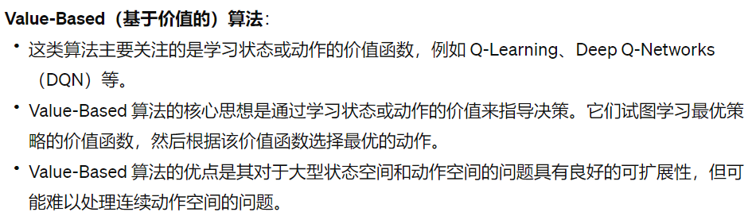
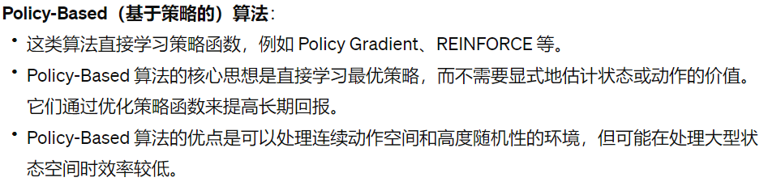
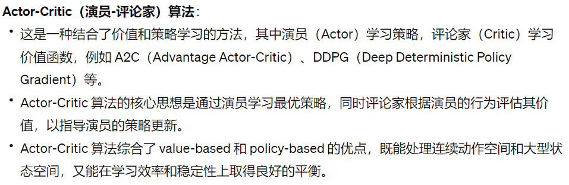
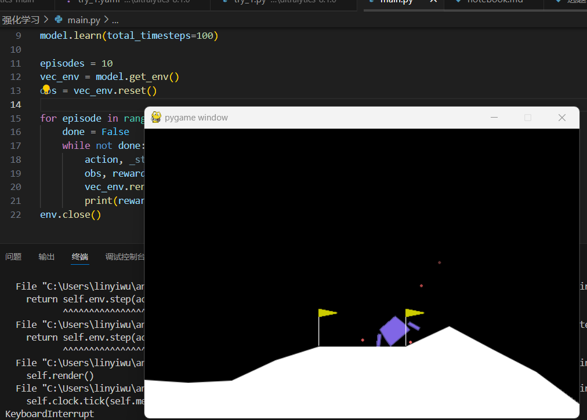

# 强化学习笔记
## 强化学习基础
### 监督学习
1. 每一个学习的内容都是有标签的
2. 监督学习的目标是预测标签
3. 监督学习是给定输入，预测输出
- 最经典的就是分类任务
### 无监督学习
1. 每一个学习的内容都是没有标签的
2. 无监督学习的目标是发现数据的规律
3. 无监督学习是给定输入，发现数据的规律
- 最经典的就是聚类任务，有各种团簇算法
### 强化学习
1. 强化学习的特点是有一个自己的学习环境
2. 强化学习的目标是找到最优策略
3. 可以理解成一个特殊的监督学习，每一个动作都会有对应的奖励。
4. 强化学习是给定输入，选择动作，获得奖励，然后更新策略

## 强化学习的量化
- MDP过程（从感性认知到量化）
- 可以用一个向量<S, A, P, R, γ>来描述Agent和环境
1. S：一个有限的状态集合
2. A：一个有限的动作集合
3. P：一个转移概率矩阵，P[s, a, s']表示在状态s下，执行动作a，转移到状态s'的概率
4. R：一个奖励函数，R[s, a]表示在状态s下，执行动作a，获得奖励r
5. γ：一个折扣因子，用于控制未来奖励的权重（反映了更加重视短期利益还是长期利益）。
- γ值越接近于1，那么就越重视长期利益；γ值越接近于0，那么就越重视短期利益
- 量化系列动作：用在环境中的一整套动作获取的总Reward值来评估策略获得的收益

## 强化学习算法
- Value based

- Policy based

- Actor-Critic

## 第一课的成果
我的小飞船可以使用A2C和PPO算法来训练飞行啦。
